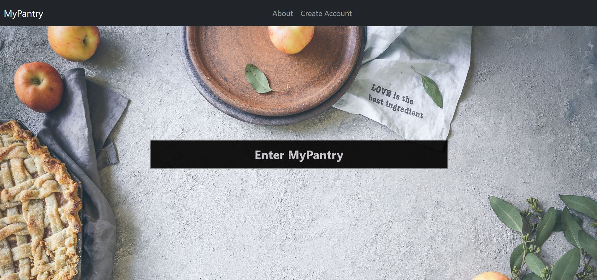

# MyPantry

MyPantry is a full stack web application that connects people through food. It aims to reduce food waste by curating recipes based on the ingredients you have on hand. It also allows to posts recipes to their profiles and like + save recipes fellow users have posted.


## Navigation

- [How It Works](#how-it-works)
- [Tech Stack](#tech-stack)
- [Setup and Installation](#setup)
- [Acknowledgments](#acknowledgment)
- [About the Developer](#about-developer)

## <a name="how-it-works"></a>How It Works

After the user is authenticated, they are taken to the landing page where they have three options:


 
<details><summary>Option 1: Enter a Recipe</summary>
<p>

#### This lets the user enter recipes they would like to be saved on their profile. JavaScripts event handlers are used to add quantities in the text boxes that show up after an ingredient is entered.

</p>
</details>

<details><summary>Option 2: Look up Recipe</summary>
<p>

#### This feature lets the user select ingredients they have available in their pantry. A multiselect bar lets the user pick various ingredients at a time and upon clicking search a GET request is made to the server which sends a filter query to the database to render the recipes available for each ingredient. Each request is also saved in the database, by date and ingredients, to give a user an opportunity to revisit their choices. This makes going back to recipes easier

</p>
</details>

<details><summary>Option 3: View my pantry</summary>
<p>

#### This features leads the profile page where the user is able to see the recipes they have posted, fellow users recipes which they have liked and previous pantry submissions they have made, sorted into a Bootstrap accordion by date stamp.

</p>
</details>

## <a name="tech-stack"></a>Tech Stack

<strong>Back-End:</strong> Python, Flask, Jinja, SQLAlchemy, PostgreSQL<br>
<strong>Front-End:</strong> HTML/ CSS, Bootstrap, jQuery, JavaScript <br>


## <a name="setup"></a>Set Up/ Installation

### Prerequisites

Please be sure to have Python 3.6 and PostgreSQL downloaded before you clone this repository.

### Installing

On local machine, go to a directory where you want to work and clone Over The Mood repository:

```
$ git clone https://github.com/mahafatima14/hb-project-my-pantry.git
```

Create a virtual environment:

```
$ virtualenv env
```

Install dependencies:

```
$ pip3 install -r requirements.txt
```

Create database:

```
$ createdb pantry
```

Build database tables and fill database with seed file:

```
$ python3 model.py
$ python3 seed.py
```

### Running Locally via the Command Line

Be sure your virtual environment is activated:

```
source virtual env/bin/activate

```

Run myPantry:

```
$ python3 server.py
```

Open your browser and navigate to:

```
http://localhost:5000/
```

### Future Features

- Add recipe restriction filter elements (ex: Kosher, Vegan, Halal) using React 
- Add the option for the recipes to be send to the user using Twilio API
- Add grocery list feature if there are few ingredients missing from the pantry

## <a name="acknowledgment"></a>Acknowledgments

Images by Brooke Lark from unsplash.com

## <a name="about-developer"></a>About the Developer

<i class="fa fa-github"></i>

